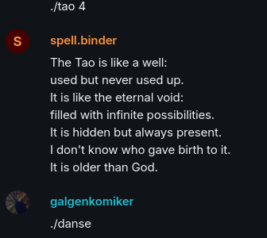
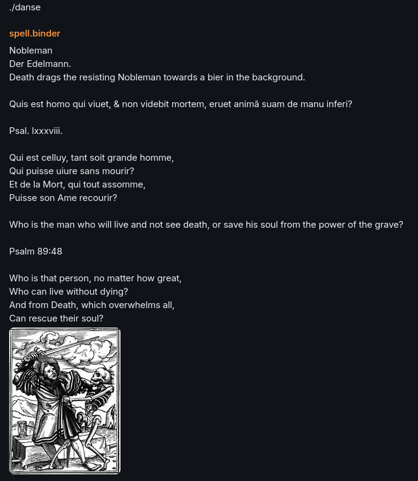

Matrix protocol chatbot that executes commands

Implemented commands:
1. ./tao {chapter}: sends a tao te ching (https://terebess.hu/english/tao/mitchell.html) chapter to chat
2. ./danse {card} sends a danse macabre card (https://www.gutenberg.org/files/21790/21790-h/21790-h.htm https://publicdomainreview.org/collection/hans-holbeins-dance-of-death-1523-5/) to the chat

